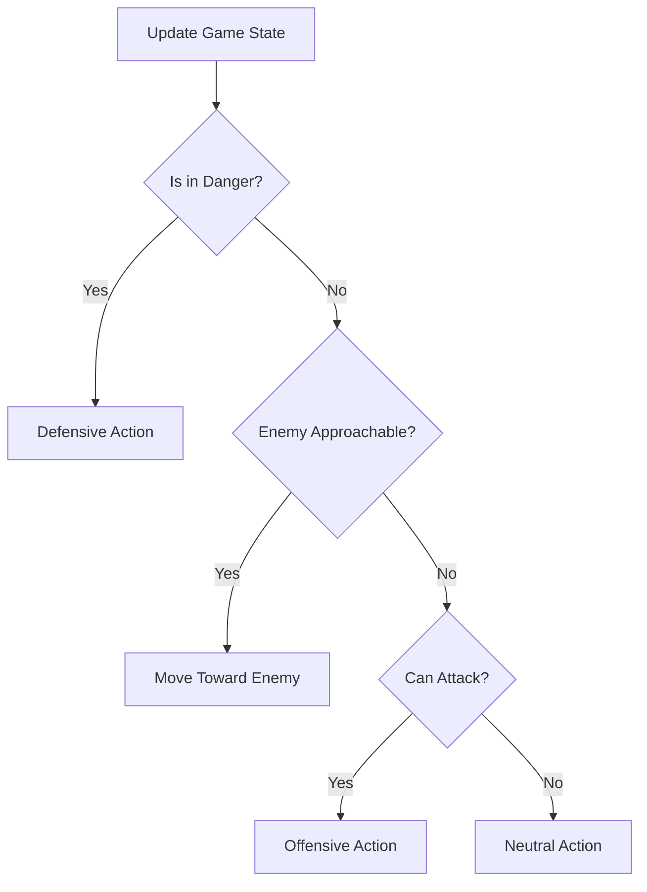

<p align="center">
  
</p>
<h1 align="center">Super Smash Brothers COM AI</h1>

<p align="center">
  
</p>

<h4 align="center">
    <a href="#overview">Overview</a>
    ·
    <a href="#features">Features</a>
    ·
    <a href="#getting-started">Getting Started</a>
    ·
        <a href="#prerequisites">Prerequisites</a>
        ·
        <a href="#installation">Installation</a>
    ·
    <a href="#how-to-play">How to Play</a>
    ·
        <a href="#controls">Controls</a>
        ·
        <a href="#game-mechanics">Game Mechanics</a>
    ·
    <a href="#ai-system">AI System</a>
    ·
        <a href="#decision-making">Decision Making</a>
        ·
        <a href="#difficulty-levels">Difficulty Levels</a>
        ·
        <a href="#character-playstyles">Character Playstyles</a>
    ·
    <a href="#technical-details">Technical Details</a>
    ·
        <a href="#project-structure">Project Structure</a>
        ·
        <a href="#ai-implementation">AI Implementation</a>
    ·
    <a href="#faq">FAQ</a>
    ·
</h4>

<p align="center">The AI Behind Super Smash Brothers using Finite State Machines & Behaviour Trees</p>

## Table of Contents

- [Overview](#overview)
- [Features](#features)
- [Getting Started](#getting-started)
  - [Prerequisites](#prerequisites)
  - [Installation](#installation)
- [How to Play](#how-to-play)
  - [Controls](#controls)
  - [Game Mechanics](#game-mechanics)
- [AI System](#ai-system)
  - [Decision Making](#decision-making)
  - [Difficulty Levels](#difficulty-levels)
  - [Character Playstyles](#character-playstyles)
- [Technical Details](#technical-details)
  - [Project Structure](#project-structure)
  - [AI Implementation](#ai-implementation)
- [FAQ](#faq)
- [Credits](#credits)
- [License](#license)

## Overview

This project demonstrates a decision-making AI system for fighting game opponents with different difficulty levels and playstyles. The gameplay is inspired by Super Smash Bros, featuring a 2D environment where characters battle to knock each other off the stage.

> [!NOTE]  
> This is a demonstration project meant for educational purposes rather than a complete game.

## Features

- 2D Visualiser built with Pygame
- CPU AI with configurable difficulty levels and playstyles
- Combat Mechanics (attacks, specials, shields, dodges)
- Character movement and platform physics
- Damage percentage system with increasing knockback
- Multiple lives and respawn system

## Getting Started

### Prerequisites

| Requirement | Version | Purpose             |
| ----------- | ------- | ------------------- |
| Python      | 3.6+    | Runtime environment |
| Pygame      | 2.0.0+  | Game framework      |

### Installation

1. Clone this repository:

   ```bash
   git clone https://github.com/WillKirkmanM/super-smash-bros-ai.git
   cd smash-bros-ai
   ```

2. Install required dependencies:

   ```bash
   pip install pygame
   ```

3. Run the game:
   ```bash
   python pygame_demo.py
   ```

## How to Play

### Controls

| Key        | Action       |
| ---------- | ------------ |
| Arrow Keys | Move/Jump    |
| Z          | Attack       |
| X          | Special move |
| C          | Shield       |
| V          | Dodge        |
| R          | Restart game |

### Game Mechanics

1. **Lives System**: Each character starts with 3 lives
2. **Damage Percentage**: Increases when hit (0% to 300%)
3. **Knockback Physics**: Higher damage = stronger knockback
4. **Death Conditions**:
   - Fall off the stage
   - Get knocked beyond the blast zones
   - Reach max damage with high velocity

> [!IMPORTANT]  
> The blast zones (death boundaries) are marked with red lines in the game. Going beyond these boundaries will cost you a life!

## AI System

### Decision Making

The AI uses a hierarchical decision-making process based on the current game state:



### Difficulty Levels

The AI has four difficulty levels that affect reaction time and decision weights:

| Difficulty | Reaction Time | Attack | Shield | Dodge | Description                           |
| ---------- | ------------- | ------ | ------ | ----- | ------------------------------------- |
| EASY       | 0.3-0.5s      | 30%    | 5%     | 5%    | Slower reactions, makes more mistakes |
| MEDIUM     | 0.2-0.3s      | 30%    | 10%    | 10%   | Balanced AI with moderate skill       |
| HARD       | 0.1-0.2s      | 30%    | 20%    | 15%   | Faster reactions, strategic decisions |
| INTENSE    | 0.05-0.1s     | 35%    | 25%    | 25%   | Expert-level AI with quick reactions  |

> [!NOTE]  
> Percentages represent decision weights - the likelihood of choosing a particular action when applicable.

### Character Playstyles

Custom playstyles can be configured through the `CharacterSpecificAI` class:

| Playstyle       | Approach | Attack | Defense | Description                              |
| --------------- | -------- | ------ | ------- | ---------------------------------------- |
| BALANCED        | Medium   | Medium | Medium  | Equal focus on offense and defense       |
| AGGRESSIVE      | High     | High   | Low     | Prioritizes attacks and approaching      |
| DEFENSIVE       | Low      | Low    | High    | Favors shielding and careful positioning |
| BAIT_AND_PUNISH | Low      | Medium | Medium  | Waits for opponent mistakes              |

## Technical Details

### Project Structure

```
smash-bros-ai/
├── pygame_demo.py        # Main game loop and rendering
├── cpu_ai.py             # Core AI decision-making system
├── character_specific_ai.py # Character-specific behaviors
├── README.md             # This documentation
└── LICENSE               # License information
```

### AI Implementation

The AI system consists of several key components:

1. **State Assessment**: Evaluates the current game state
2. **Action Selection**: Chooses from possible actions based on weights
3. **Movement Calculation**: Determines optimal movement directions
4. **Attack Selection**: Chooses appropriate attacks based on position

Example code snippet from the AI decision system:

```python
def update(self, game_state):
    """
    Update AI state and decide on an action.

    Args:
        game_state: Current state of the game including character positions,
                    damage percentages, stage hazards, etc.

    Returns:
        action: The decided action to take
    """
    self.current_state = game_state

    # First priority: defend if in danger
    if self._is_in_danger():
        return self._defensive_action()

    # Second priority: approach if enemy is not in attack range
    if self._is_enemy_approachable():
        return {"type": ActionType.MOVE, "direction": self._best_approach_direction()}

    # Last priority: attack if in range
    if self._can_attack():
        return self._offensive_action()

    # Otherwise: neutral/positioning
    return self._neutral_action()
```

> [!WARNING]  
> Modifying the AI code can significantly change gameplay behavior. Back up your files before making changes!

## FAQ

<details>
<summary>How do I change the CPU difficulty?</summary>
<br>
Modify the difficulty parameter when creating the CPU character in <code>pygame_demo.py</code>:

```python
cpu = Character(SCREEN_WIDTH * 3//4, SCREEN_HEIGHT - STAGE_HEIGHT - 100, BLUE, "Mario",
               is_cpu=True, difficulty=CPUDifficulty.HARD,  # Change difficulty here
               playstyle=CharacterStyle.AGGRESSIVE)
```

Difficulty options: EASY, MEDIUM, HARD, INTENSE

</details>

<details>
<summary>Can I create custom AI playstyles?</summary>
<br>
Yes! Extend the <code>CharacterStyle</code> enum in <code>character_specific_ai.py</code> and add your custom behavior in the <code>CharacterSpecificAI</code> class.
</details>

<details>
<summary>Why does the AI sometimes get stuck?</summary>
<br>
This can happen due to conflicting decision priorities. Try adjusting the decision weights in the <code>_set_decision_weights</code> method of the <code>CPUAI</code> class.
</details>
